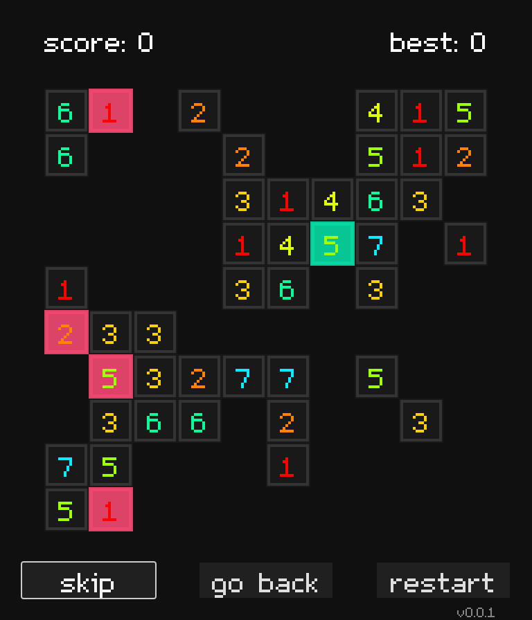

# Exploding Boxes

## Try it here: [Exploding Boxes](https://lorossi.itch.io/exploding-boxes)

## Screenshots

### How to play

Basically the same rules as [Fruit Box](https://en.gamesaien.com/game/fruit_box/), with a few exceptions:

- Draw a rectangle with the mouse to select boxes whose score adds up to 10
- Eliminating a square grants one point
- After eliminating square, there's a chance for remaining boxes to take damage, reducing their score
- When a box score reaches 0, it dies
- No time limit - the game ends when there are no more boxes on the screen or when it's not possible to make a move

This game features 3 *special* boxes:

- Red box: explodes when reaches 0, damaging all neighbouring boxes
- Green box: grows back when eliminated
- Blue box: grants 5 points when eliminated

## Some Background

Exploding Boxes is a simple game inspired by Fruit Box, a game I found out only about two weeks ago.

One afternoon I was browsing the [featured section of itch.io](https://itch.io/games/new-and-popular/featured), looking for new and interesting ways to procrastinate, and I found this *blocky* game where you had to group boxes to score 10 points.
It was entered for a game jam in which the theme was something related to having a maximum size of code, so the game was very simple and had no sound or animations;
however, it really caught my attention because it was really minimalistic and yet very fun to play.

Of course I can't find the game anymore, since I can't even remember its name, but if anyone knows what I'm talking about, please let me know so I can give proper credit to the original creator.

For a while now I have been trying to get into game development *(for the sake of it, just because I wanted to try it out)*, but one of the things that holds me back is my complete lack of any artistic skill.
I can code, I can write, but I really can't draw or design anything that looks remotely good.

In this painful journey of mine, I have been thinking about how I could solve this problem with a different approach, landing on puzzle games.
I feel that they are often easier to make as they don't require extensive art assets and don't require a script or a story to be engaging.

So, going back to Fruit Box (and its clone), I decided that I wanted to implement my own version of it, with a few twists.

I quickly wrote down some ideas, including:

- the game needed to be more "relaxed" than the original, with no time limit
- the user had to think about the move for a little while before making it, instead of maximising the number of eliminations
- there needed to be more ways to score points
- the boxes needed to interact with each other

So, after a few gruelling days of off-and-on coding (I still have exams to do, sadly) I convinced myself that the game was ready to be published.

This is the first game I have ever published, hoping to make more of them in the future.

I hope you enjoy it!

## Credits

- Font used in the game is [m5x7](https://managore.itch.io/m5x7) by Daniel Linssen

## License

This project is licensed under the MIT License - see the [LICENSE.md](LICENSE.md) file for details.
